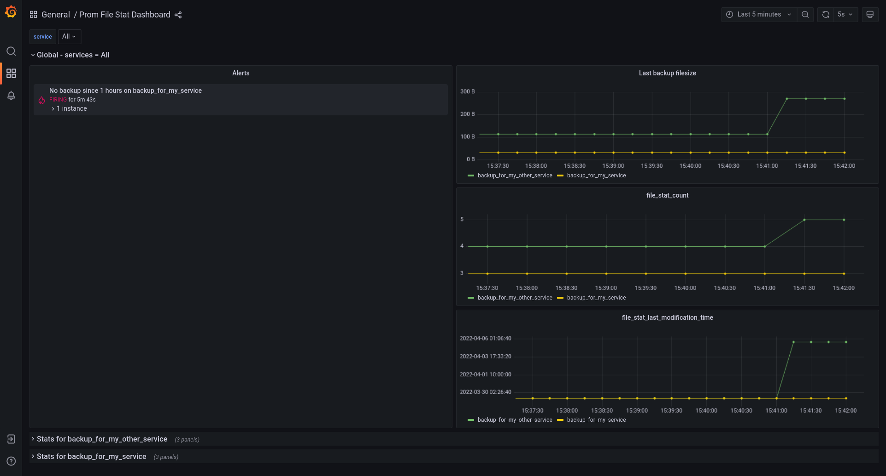
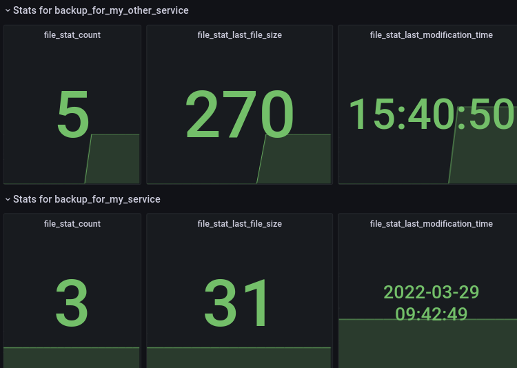

# Prometheus File Exporter

Prometheus File Exporter is a Prometheus exporter to monitor file state.

PFE exposes 3 metrics:

- **file_stat_count** (File count for the service)
- **file_stat_last_modification_time** (Unix timestamp corresponding to the last file modification for the service)
- **file_stat_last_file_size** (Size in bytes of the latest modified file for the service)

PFE is useful to monitor your backup directory.

```python
# HELP file_stat_count File count for the service
# TYPE file_stat_count gauge
file_stat_count{service="backup_for_my_service"} 1.0
file_stat_count{service="backup_for_my_other_service"} 2.0
# HELP file_stat_last_modification_time Unix timestamp corresponding to the last file modification for the service
# TYPE file_stat_last_modification_time gauge
file_stat_last_modification_time{service="backup_for_my_service"} 1.64916739e+09
file_stat_last_modification_time{service="backup_for_my_other_service"} 1.649167313e+09
# HELP file_stat_last_file_size Size in bytes of the latest modified file for the service
# TYPE file_stat_last_file_size gauge
file_stat_last_file_size{service="backup_for_my_service"} 0.0
file_stat_last_file_size{service="backup_for_my_other_service"} 9.0

```

# How to configure

Use environnement variables to override default settings, you can edit them in `env/pfe.env`:

| Name                   | Default    | Description                           |
|------------------------|------------|---------------------------------------|
| SCRAP_INTERVAL_SECONDS | 60         | Interval between two metrics update   |
| EXPORTER_PORT          | 9000       | Port to expose metrics in container   |
| YAML_CONFIG_PATH       | config.yml | PATH of PFE configuration file        |

## Expose the PFE port

Create a `docker-compose.override.yml` with the following lines to expose the port 9000 on your system.

```yaml
# docker-compose.override.yml
version: '3.6'
services:
  pfe:
    ports:
      - 9000:9000
```


# Try it
## Docker-Compose
A `docker-compose.yml` with Prometheus File Exporter is available.
For demo purpose, `test.docker-compose.override.yml` can be used to expose a Prometheus and Grafana service.

Dashboards and Alerts are in `./docker`.


Let's try with: 
```bash
docker-compose -f docker-compose.yml -f test.docker-compose.yml up
```

Grafana is exposed on [localhost:3000](http://localhost:3000/d/pfe/prometheus-file-exporter)  
Prometheus on [localhost:9090](http://localhost:9090)  
Exporter on [localhost:9000](http://localhost:9000)  

> Use docker-compose.yml to override environnement variables and configure PFE

### Grafana Screenshots 
#### Full dashboards

#### Dashboard by services


## Directly on your system

Let's try with:
```bash
pip3 install -r requirements.txt
python3 -m src.exporter
```
> Use `export` to set environnement variables and configure PFE


# Drivers

PFE has been designed to support multiple drivers. You can write your own driver to track file on a cloud provider, or whatever you want.

## DriverLocal

DriverLocal is for local file monitoring.

This `config.yml` will track all files ending with `.tar.bz2` and `.sql` in the directory `/home/backup/mybackups/`

```yaml
#config.yml
---
services:
  backup_for_my_service:
    driver:
      name: DriverLocal
      config:
        path: ./test_data/backup_for_my_service/*.sql.gz

  backup_for_my_other_service:
    driver:
      name: DriverLocal
      config:
        path: ./test_data/backup_for_my_other_service/*.tar.bz2

```

## Write your own driver

Create a file `my_driver.py` in `src/drivers/`. Starting with driver_quickstart.py is recommended.

```bash
cp src/drivers/driver_quickstart.py src/drivers/mydriver.py
```

### Make it available for PFE

First, rename your class in `src/drivers/mydriver.py`.

```diff
 from src.drivers.driver_interface import DriverInterface
 
-class DriverQuickstart(DriverInterface):
+class MyDriver(DriverInterface):
 
     # Overriding the constructor is optional
     # def __init__(self, driver_config):
```

Then, add it in `src/drivers/__init__.py`

```diff
 from .driver_local import DriverLocal
+from .mydriver import MyDriver
```

You can now use `MyDriver` in your `config.yml`

> NB: A Python logger is available with `self.logging`
> 
### Use your configuration in your driver's code

You can access all your driver's configuration with `self.driver_config`.  
It means that if your configuration file is: 
```yml
#config.yml
---
services:
  backup_for_my_other_service:
    driver:
      name: MyDriver
      config:
        foo: bar
```

You can get the value of `foo` in your driver with:
```python
foo = self.driver_config['foo']
```


### Override get_metrics()

Override the `get_metrics` method and make it return a dict with the following keys:

- latest_backup_timestamp
- latest_backup_size
- backup_count

Now, use your favorites library/API to gather your values.

```python
def get_metrics(self):
    metrics = dict()
    metrics["backup_count"] = requests.get("MYAPI")
    metrics["latest_backup_timestamp"] = datetime.datetime.now().timestamp()
    metrics["latest_backup_size"] =  len(requests.get("MYAPI"))
    return metrics
```
